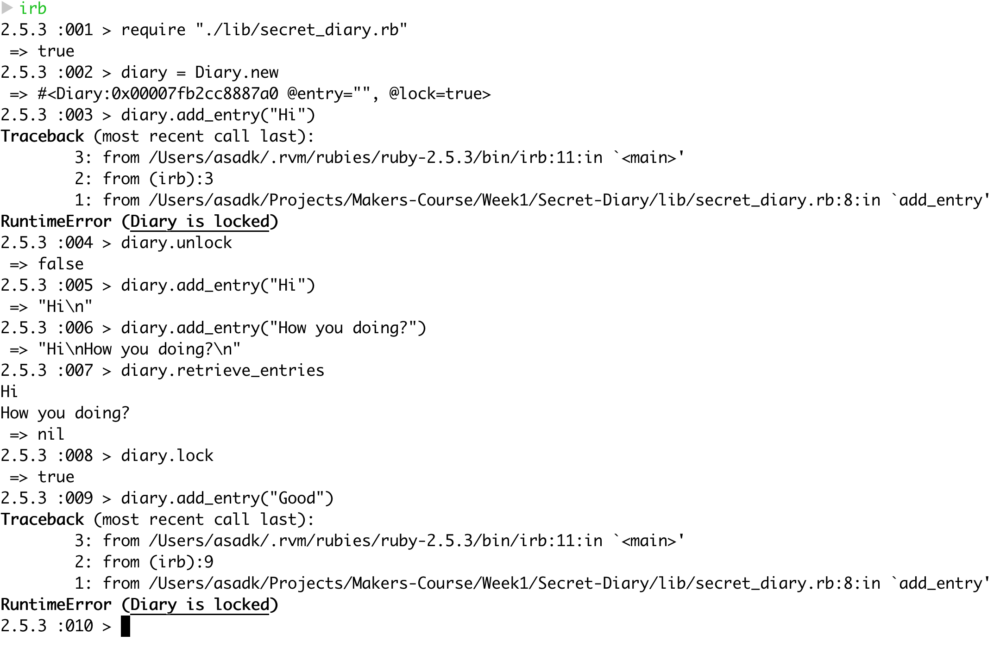

# Secret-Diary
This is a secret diary! To run in command line please fork.

Then you will need to run the following string in an IRB
```
require "./lib/secret_diary.rb"
```

Then please place this into a variable by instantiation, for example:
```
diary = Diary.new
```

The following commands are available to use
```
1. diary.add_entry("Your entry here")
2. diary.get_entries
3. diary.lock
4. diary.unlock
```

## Running the tests & linter

Once the repo is forked or cloned, cd into it and run the ```rspec``` command from the command line

To run the linter, please run ```rubocop``` from the command line

# Example of app in usage


